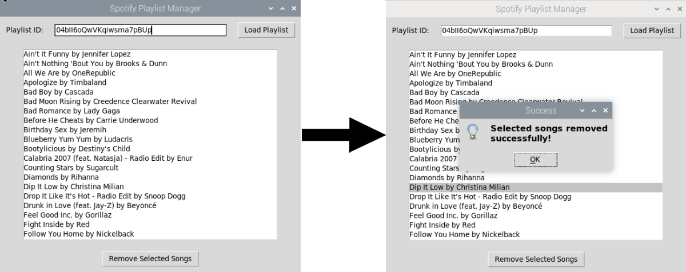

# Spotify: Remove Songs from Playlist

This script uses Spotify's API to get the song list of a specific playlist using the playlist ID, then allows you to select multiple songs to remove from the playlist in one easy step.
  

Table of Contents

- [About The Project](#about-the-project)
  - [Built With](#built-with)

## About The Project
This project was designed due to the difficulity of removing numerous songs from a playlist at once. The script eliminates the manual process of having to 
select one song at a time, right-clicking, and removing from playlist.

(<a href="#readme-top">back to top</a>)

### Built With

(<a href="#readme-top">back to top</a>)

